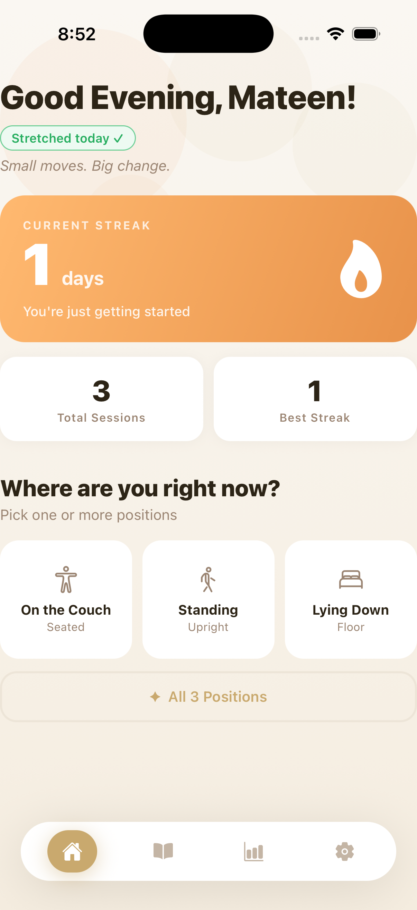
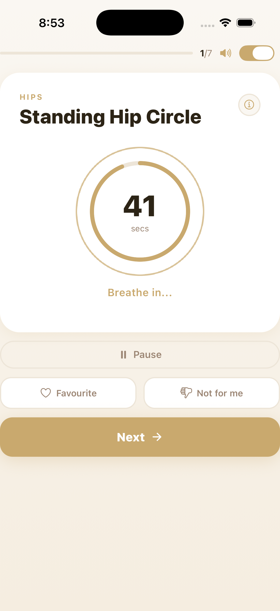
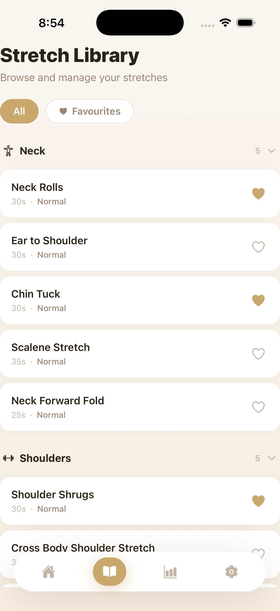
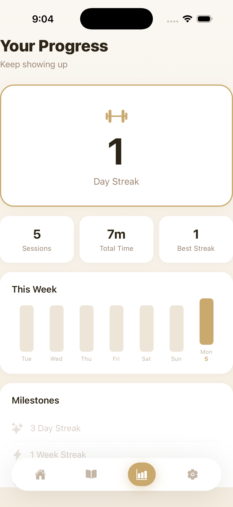
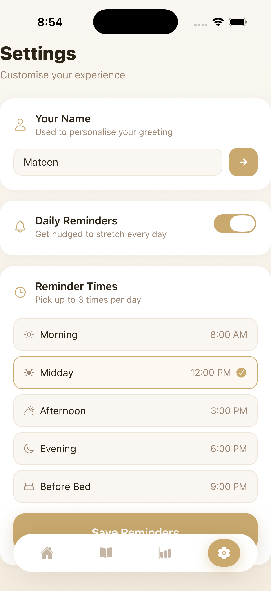
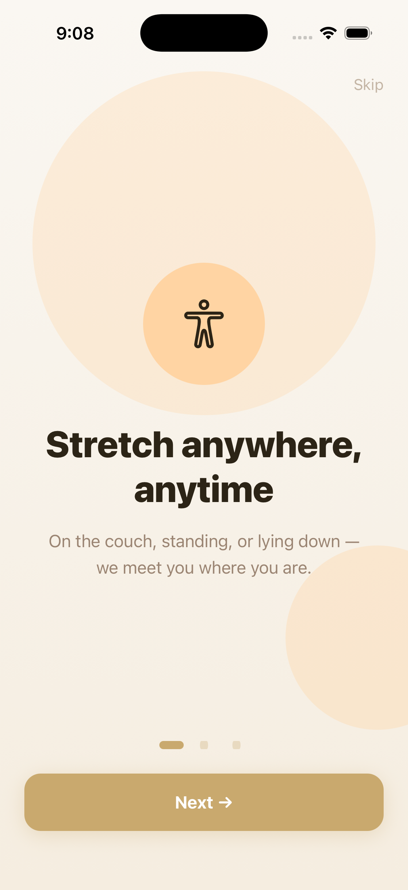

# Unwind

A calm, minimal stretching app that guides you through a short session. Voice cues, breathing prompts, a streak to keep you coming back, then it gets out of your way.

I built Unwind to get properly hands-on with React Native, and honestly because most stretching apps I tried were either bloated with subscriptions and social features, or so bare-bones they felt like a glorified stopwatch. It's a portfolio project, not a commercial app, but I tried to build it like it mattered. That included going back and fixing real bugs I found once I actually started using it instead of just writing it.

---

## Try it yourself

Install [Expo Go](https://apps.apple.com/app/expo-go/id982107779) on your phone, then scan the QR code below to run Unwind directly, no build or setup needed.


Or open this link on your phone: [expo.dev/preview/update](https://expo.dev/preview/update?message=Portfolio+demo&updateRuntimeVersion=1.0.0&createdAt=2026-08-25T03%3A56%3A08.546Z&slug=exp&projectId=a6692162-8774-4b48-99b2-1d6770c5c1ee&group=1e0ee6d9-582d-47a1-a968-990ad5a8b064)

Or try it instantly in your browser, no install at all: [unwind-stretching-app.vercel.app](https://unwind-stretching-app.vercel.app)

*(Voice cues and haptics are mobile-only features and won't fire in a browser, but everything else works the same.)*

---

## Screenshots

| Home | Session | Library |
|------|---------|---------|
|  |  |  |

| Progress | Settings | Onboarding |
|----------|----------|------------|
|  |  |  |

---

## What it does

- **Adaptive stretch selection.** Sessions lean toward stretches you favourite and away from ones you skip, using a proper weighted-random algorithm instead of a fixed rotation.
- **Voice-guided sessions.** Spoken stretch names, halfway and wrap-up cues, and "breathe in / breathe out" prompts synced to the timer.
- **Position and body-part filtering.** Pick where you are (couch, standing, lying down) and what you want to target, and the session gets built from a library of 50+ stretches matching both.
- **Streak tracking.** Daily streaks, a 7-day activity chart, session history, and milestone badges, all saved locally.
- **Haptic feedback** on selections, transitions, and completion.
- **Favouriting and feedback.** Heart a stretch or mark it "not for me" mid-session, which directly feeds the weighting above.
- **Daily reminders** with custom time slots, through local push notifications.

Everything works offline. No account, no backend, just local storage.

---

## Tech

React Native and Expo (Expo Router, TypeScript). `react-native-reanimated` handles the animated timer and onboarding carousel, `expo-speech` does the voice, `expo-haptics` handles feedback, `expo-notifications` runs the reminders, and `@react-native-async-storage/async-storage` covers everything that persists. Icons are Ionicons throughout. No emoji anywhere in the UI, which actually took a real cleanup pass to get right.

---

## How it's put together

```
app/
├── (tabs)/        Home, Library, Progress, Settings (the tab bar)
├── session.tsx    Active stretch session: timer, voice cues, feedback
├── bodypart.tsx   Muscle-group picker
├── onboarding.tsx First-launch parallax carousel
└── complete.tsx   Post-session summary and streak celebration
components/        Reusable UI: timers, buttons, modals, animated numbers
utils/
├── stretches.ts   The stretch data set (50+ entries)
├── weights.ts     Weighted-shuffle algorithm plus favourites/weight persistence
├── streaks.ts     Streak calculation, session history, weekly chart data
├── reminders.ts   Local notification scheduling
└── theme.ts       Shared design tokens: colors, gradients, shared styles
```

A few things worth pointing out:

The weighting algorithm in `utils/weights.ts` is a pure function. Give it a stretch list and a weights map, it gives back a shuffled list. No side effects, easy to reason about, easy to test.

Colors, gradients, and shared component styles all live in `utils/theme.ts`. The palette is a warm cream and caramel rather than the cold, high-contrast look most fitness apps default to. That was a deliberate choice to make a few minutes of stretching feel calm instead of like a workout.

Session state (`app/session.tsx`) is the most complex file in the app by far. It's juggling a countdown timer, voice narration, breathing-cue timing, and pause/resume all at once, and it went through a few real rewrites as I found bugs in it.

---

## Running it

```bash
git clone https://github.com/MateenM10/unwind.git
cd unwind
npm install
npx expo start
```

Scan the QR code with Expo Go, or press `i` for the iOS Simulator. No API keys or setup needed, everything's local.

---

## What I learned

Most of what I got out of this was the gap between "it runs" and "it's actually correct." A few bugs only showed up once I used the app repeatedly instead of just reading the code.

The weighted shuffle wasn't actually weighted. I found this one by accident, I favourited a stretch a bunch of times expecting to see it more, and it just didn't show up more. Turned out the sort comparator had an operator precedence bug: `Math.random() - 0.5 / totalWeight` instead of `(Math.random() - 0.5) / totalWeight`. JavaScript doesn't care about your intentions, it just runs the math left to right by precedence rules, so that 0.5 was quietly dividing by weight instead of being part of the subtraction. Favourited stretches were basically no more likely to show up than anything else. I ended up rewriting it with a proper weighted sampling method (each stretch gets a random key scaled by its weight, then you sort by that), but the real lesson was dumber than the fix: I'd written a feature, watched it "work" in the sense that the app didn't crash, and moved on without ever checking if it did what I actually wanted.

React Native's native animation driver only supports `transform` and `opacity`. My onboarding screen's dot indicators originally animated `width` directly, which throws at runtime the moment the driving value is on the native thread. I swapped it for a `scaleX` transform on a fixed-width dot instead. As a side effect, that also fixed a subtle layout shift the original version had.

I also had a stale-closure bug in the voice toggle. Turning voice guidance on called a function that checked a state variable from inside the same handler that had just set that state, so it silently read the old value and did nothing. Fixed it by mirroring the toggle into a ref that's always current instead of relying on the render closure.

And I cut a feature that was already partly built. I generated a couple of proof-of-concept stretch animations with an AI video tool, but they came out with the tool's watermark baked into the video, so I pulled them rather than ship branded content in something meant to look finished. The wiring for animations is still in the code. It just skips the section gracefully when a stretch doesn't have one, so adding real animations back later is a one-line change.

---

## Development notes

I used AI tools (Claude) as a pair-programming assistant on this, mostly for debugging (a few of the bugs above I found because I was walking through the app screen by screen with it), talking through naming and branding decisions, and repetitive refactors and cleanup work. Every product decision, the feature scope, and what got cut were mine. I reviewed and understood everything that went in. Felt worth being upfront about, since it's how I actually work.

---

## Things I'd add next

- A real animation library, generated cleanly without any tool watermarks
- Dark mode
- Automated tests for the weighted-shuffle algorithm and streak logic, since both are pure functions and would be easy to cover
- Empty states for the Library tab when no favourites exist yet
- Testing on a physical Android device (the config is there, just unverified)

---

_Built with React Native & Expo._